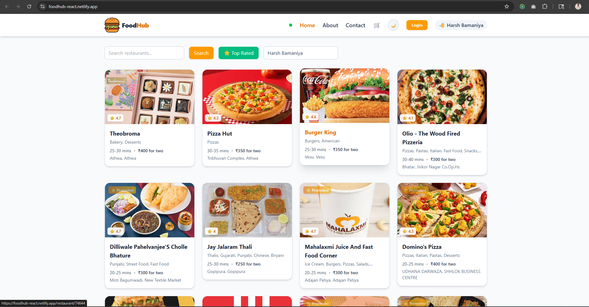
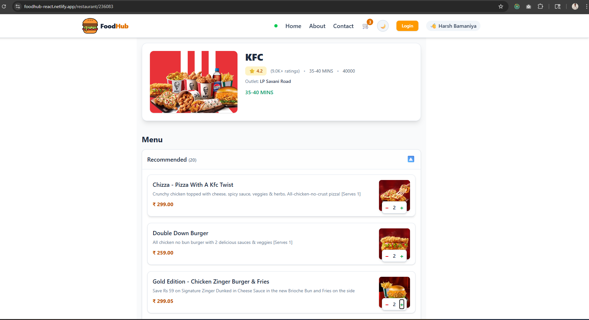
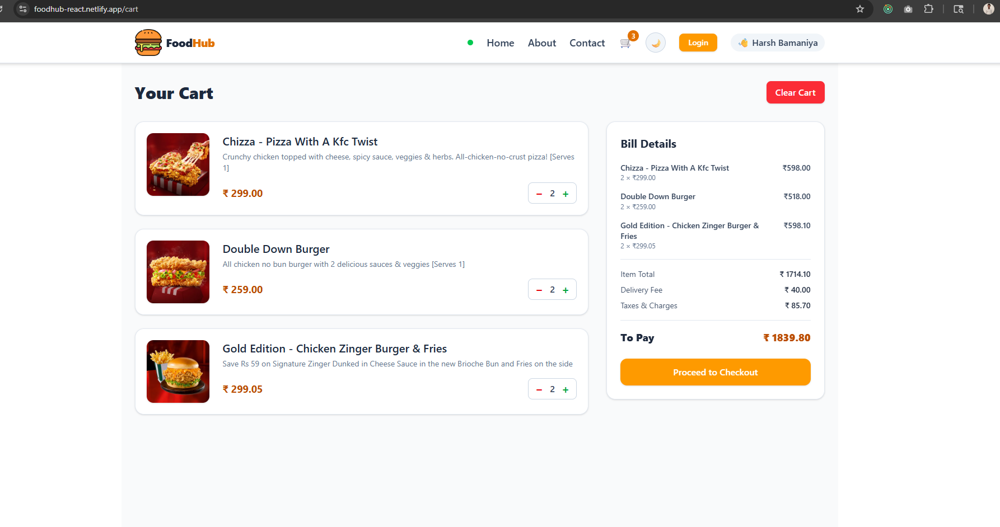
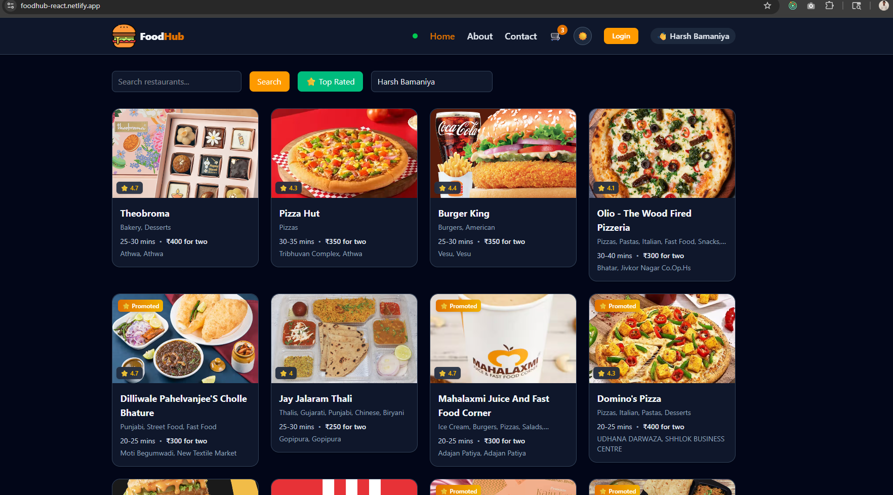
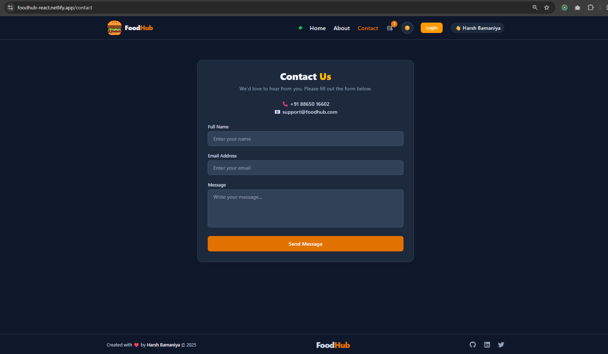

# Food Hub 🍔

A full-featured food ordering web application built with React.js and Redux Toolkit.

**Live Demo:** [https://foodhub-react.netlify.app/](https://foodhub-react.netlify.app/)

---

## Screenshots

| Home | Menu Items | Cart | Home (Dark) | Contact |
|------|-----------|------|-------------|---------|
|  |  |  |  |  |

---

## Features

- Browse restaurants and menus with live data from the FoodFire API
- Add/remove items from cart with real-time price calculation
- Global state management using Redux Toolkit
- Client-side routing with React Router v6
- Responsive design with Tailwind CSS v4
- HTTP requests handled with Axios
- Unit tested with Jest and React Testing Library
- Lazy loading with React.lazy and Suspense for faster initial load

---

## Tech Stack

| Category | Technology |
|----------|-----------|
| Frontend | React.js 19, JavaScript (ES6+), Tailwind CSS v4 |
| State Management | Redux Toolkit, React Redux |
| Routing | React Router DOM v6 |
| HTTP Client | Axios |
| Testing | Jest, React Testing Library, jest-environment-jsdom |
| Build Tool | Parcel v2 |
| Icons | React Icons |
| Deployment | Netlify |

---

## API

This project uses the **[FoodFire API](https://foodfire.onrender.com)** — a community-maintained proxy of restaurant and menu data.
```
https://foodfire.onrender.com/api/restaurants?lat=21.1702401&lng=72.83106070000001&page_type=DESKTOP_WEB_LISTING
```

> **Note:** The FoodFire API is a free hosted service. Response times may vary depending on server load.

---

## Run Locally
```bash
git clone https://github.com/harsh2aug/food-hub
cd food-hub
npm install
npm start
```

The app will open at `http://localhost:1234` (Parcel's default port).

To run tests:
```bash
npm test
```

---

## Project Structure
```
food-hub/
├── assets/
│   └── screenshots/
├── src/
│   ├── components/
│   ├── store/
│   ├── utils/
│   └── App.js
├── index.html
├── package.json
└── README.md
```

---

## What I Learned

- **Redux Toolkit** for cart state management across multiple components
- **Lazy loading** with `React.lazy` and `Suspense` to improve initial load time
- **Jest + React Testing Library** for component unit testing
- **Axios** for API integration with proper error handling and loading states
- **Parcel v2** as a zero-config bundler for fast development builds
- **React Router v6** for client-side navigation and nested routes

---

## Author

**Harsh Bamaniya**
- GitHub: [@harsh2aug](https://github.com/harsh2aug)
- LinkedIn: [harsh-bamaniya](https://linkedin.com/in/harsh-bamaniya-b2b81b218)

---

## License

MIT
